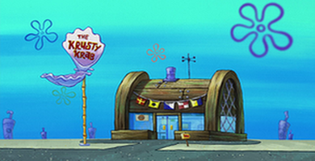

# Krusty Krab Ordering System
The purpose of this program is to provide an easy and simple way for Krusty Krab cashiers to add, edit, delete, and view
orders. It is designed to be easy and efficient, and allows the storage of orders for future records.

## Install required libraries

The libraries needed to be imported are:

- Tkinter
- Pillow
- csv
- time
- os

## Auto testing

The test_Order file will be opened and the Order class is checked.
```shell
$ pytest -v
```

## To run the program:
Click run on the top right of your python IDE window or enter the following into your python shell:
```shell
$ python order_system.py
```

# Functionality:

## Classes
### Order class
#### Variables
The class has one class variable: order_num

Each Order instance has the following instance variables:
1. customer_name: private, string
2. item_list: private, list
3. order_total: private, float
4. order_time: private, str
5. name getter
6. name setter

#### Methods
Order has the following methods:
- @classmethod set_order_num
- Dunder "__init\__" method
- Dunder "__str\__" method


## Main Menu
There are 4 radio buttons for the cashier's options: add an order, edit an order, delete an order, and view orders. Once the submit
button is pressed, then the window will change to the one selected.

### Adding an order
When the submit button is pressed, a new Order object will be created based on the information entered in the text entry boxes as well as the checkboxes selected
in the GUI.

### Edit an order
When the submit button is pressed, the Order object with the order number provided will be overwritten with the
checkboxes selected in the GUI.

### Delete an order
When the submit button is pressed, the Order object with the order number provided will be deleted from the list of Order objects.

### View orders
All current orders created in the app instance saved to the list of orders will be displayed to the screen.

### Exit & Save to File
All Order objects created and added to the list of orders will be saved to a CSV. The program will then exit.

# CSV Output
### orders.csv

| Name      | Items                                          | Total Price | Order number | Order time |
|-----------|------------------------------------------------|-------------|--------------|------------|
| Spongebob | ['Krabby Patty', 'Kelp Shake', 'Krabby Fries'] | 12.75       | 1            |   Sun Nov 20 12:53:12 2022         |
| Squidward | ['Kelp Shake', 'Krusty Krab Pizza']            | 11.50       | 2            |   Sun Nov 20 12:53:20 2022         |

All orders made in the app instance will be saved to this CSV.

